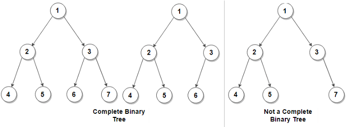

# Count the Number of Nodes in a Complete Binary Tree

## Summary

Given a **complete** binary tree, count the number of nodes.

Note:

In a complete binary tree every level, except possibly the last, is completely filled, and all nodes in the last level are as far left as possible. It can have between 1 and 2h nodes inclusive at the last level h.

The definition of a complete binary tree from [Wikipedia](http://en.wikipedia.org/wiki/Binary_tree#Types_of_binary_trees)


## Input

You are given the root node of the tree.

## Output

The number of nodes in the tree.

## Example

```
Input: the root node of the tree below

    1
   / \
  2   3
 / \  /
4  5 6

Output: 6
```

## Tips

1. The naive solution has O(n) time complexity but there exists a more efficient solution. Can you find it?
2. A completely full binary tree has 2^n - 1 nodes (where n is the height of the tree).
