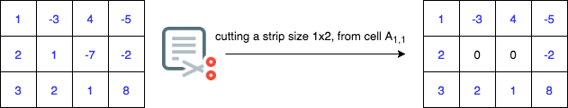

# Strips

You are given a 2-d integer array and an integer. You need to find a rectangular strip of a length lesser than or equal to the given integer and return the maximum sum over all subarrays.

Apart from this, you are also given an integer. Your task is to cut valid rectangular strips of length lesser than or equal to the given integer, from the 2-d array, and return the maxiumum sum over all subarrays of the resultant 2-d array.

What is a valid strip?

* A strip is any one dimensional rectangular subarray, cut vertically or horizontally, keeping in mind that the length of the strip is less than or equal to the given integer.
* The process of cutting a strip is the process of assigning 0's to all array elements covered by the strip.

For example, from the array shown below, we decide to cut a strip of size 1x2 starting from the cell , then after the cut, the array looks like:



A strip of size  can also be cut from the above array. Keep in mind that once the strip is cut, you need to obtain the maximum sum over subarrays and hence, cut accordingly.

The goal is to return a maximum sum over subarrays of the given 2-d array after a valid strip is cut from the original array. Complete the function cutAStrip that takes a 2-D array input and return an integer denoting the maximum sum over subarrays after a valid strip is cut.

## Input

The function takes:

- `k` - Integer based on which the size of the strip is decided (so if it's 1 x `x` or `x` x 1 for 1 <= `x` <= `k`)
- a 2-D array

## Output

A single integer

## Example

Input: `2`, `[[1, -3, 4, -5], [2, 1, -7, -2]]`

Output: `5`

In this case, one solution is to cut out the whole second column (a vertical strip of size 2x1) resulting in a grid:

```
[
  [1, 0, 4, -5],
  [2, 0, -7, -2]
]
```

and then we take the subarray `[1, 0, 4]` as the result to get a max sum of `5`.