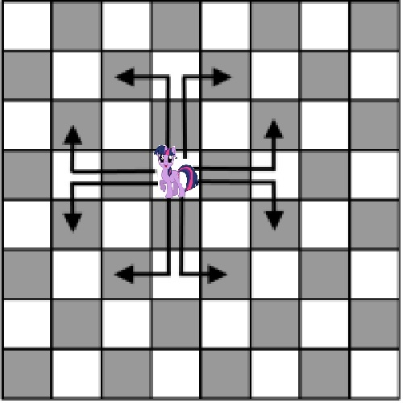

# Knight's Journey

## Summary

In the game of chess, a knight moves in the following fashion:

After retiring from his successful career as a chess knight, our knight decides to travel the world, but finds that he encounters many obstacles. Suppose you are given a grid that represents a map where each cell in the grid is a boolean. The knight wishes to travel from the top left corner to the bottom right corner of the grid. If the cell contains a false, that means there is an obstacle and the knight cannot travel onto that space.

The knight can jump over obstacles as long as he lands on a square that contains no obstacles.

Calculate how many hops it takes to get to the bottom right corner of the grid, or if such a journey is even possible

## Input

A grid of booleans, where each boolean represents whether the knight can land on that square.

## Output

An integer, that indicates how many moves it takes to get the knight to the bottom right corner OR -1 if it is impossible.

## Examples

| Input | Input (Readable) | Output |
| --- | --- | --- |
| `[[true, true, true], [true, true, true]]` | `111` `111` | 1 |
| `[[true, false, false, false, false], [false, false, true, false, false], [false, false, false, false, true]]` | `10000` `00100` `00001` | 2 |
| `[[true, false, true, false, false], [false, false, true, false, false], [false, true, true, true, false], [false, true, true, true, false], [true, false, false, true, true]` | `10100` `00100` `01110` `01110` `10011` | 4 |
| `[[true, true, false, false, true, true], [true, true, false, false, true, true], [true, true, false, false, true, true]]` | `110011` `110011` `110011` | -1 |
| `[[true, true, true, true, false, true], [true, false, true, true, true, true], [true, true, true, true, true, true], [false, true, true, true, false, true], [true, true, true, false, true, true], [true, true, true, true, true, true]]` | `111101` `101111` `111111` `011101` `111011` `111111` | -1 |

## Complexity Goals

`n` is the number of cells in the grid

* Time Complexity: **O(n)**
* Space Complexity: **O(n)**
